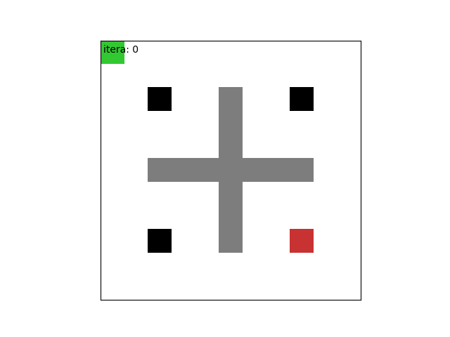
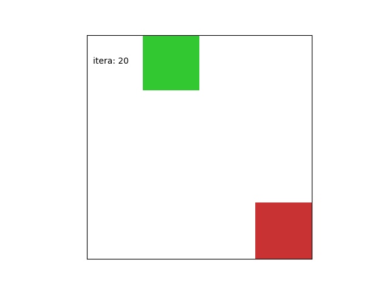

green means observe, red means terminal, black means traps, grey means obstacles

# Q_learning

predict path: 
	(0, 0) -> (1, 0) -> (2, 0) -> (3, 0) -> (3, 1) -> (4, 1) -> (5, 1) -> (6, 1) -> (6, 2) -> (7, 2) -> (7, 3) -> (8, 3) -> (9, 3) -> (9, 4) -> (9, 5) -> (9, 6) -> (9, 7) -> (8, 7) -> (8, 8)

# Sarsa 

predict path: 
	(0, 0) -> (1, 0) -> (2, 0) -> (3, 0) -> (4, 0) -> (5, 0) -> (5, 1) -> (6, 1) -> (6, 2) -> (6, 3) -> (7, 3) -> (7, 4) -> (8, 4) -> (9, 4) -> (9, 5) -> (9, 6) -> (9, 7) -> (8, 7) -> (8, 8)

# DQN 

predict path: 
	(0, 0) -> (1, 0) -> (1, 1) -> (1, 2) -> (2, 2) -> (3, 2) -> (3, 3)